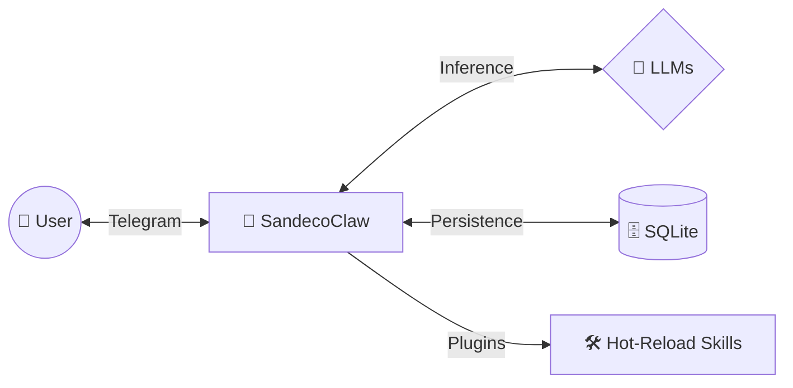

# 🤖 SandecoClaw

> **Your Premium Personal AI Agent, running 100% locally and controlled via Telegram.**

[](https://www.typescriptlang.org/)
[](https://nodejs.org/)
[](https://www.sqlite.org/)
[](https://grammy.dev/)

---

## ✨ Overview

**SandecoClaw** (Agent-Casa) is a sophisticated, private AI agent designed to live on your local machine. It combines the power of modern Large Language Models (LLMs) with the convenience of a Telegram interface and a modular "Skill" architecture.

Unlike cloud-based agents, **SandecoClaw** keeps your data where it belongs: on your computer.

---

## 🚀 Key Features

- 📱 **Telegram Interface**: Command your agent from anywhere using the Telegram app.
- 🧠 **Multi-LLM Support**: Seamlessly switch between **Gemini**, **Groq**, and **DeepSeek**.
- 🛠️ **Hot-Reload Skills**: Add new capabilities by simply dropping a Markdown file into a folder.
- 🔄 **ReAct Engine**: Advanced reasoning loop for multi-step task execution.
- 🎙️ **Multimodal**: Supports voice (STT/TTS), PDF parsing, and file generation.
- 🔒 **Privacy First**: Local SQLite storage and strict User ID whitelist.

---

## 🏗️ Architecture at a Glance



*For more details, see the [Architecture Documentation](docs/ARCHITECTURE.md).*

---

## 🛠️ Quick Start

### 1. Prerequisites
- Node.js v20+
- A Telegram Bot Token ([@BotFather](https://t.me/botfather))
- An LLM API Key (Gemini, Groq, or DeepSeek)

### 2. Setup
```bash
# Install dependencies
npm install

# Configure environment
cp .env.example .env
# Edit .env with your tokens and whitelist IDs
```

### 3. Run
```bash
npm run dev
```

*Check the full [Setup Guide](docs/SETUP.md) for step-by-step instructions.*

---

## 🧩 The Skills System

SandecoClaw is extensible. You can create specialized "Skills" (plugins) without writing a single line of code. Just define your instructions in a `SKILL.md` file and drop it into the `.agents/skills` folder.

- [How to create Skills](docs/SKILLS.md)
- [Available Skills Examples](.agents/skills/)

---

## 📚 Documentation

Detailed documentation is available in the `docs/` directory:

- 🏗️ [Architecture](docs/ARCHITECTURE.md) - How it's built.
- ⚙️ [Setup Guide](docs/SETUP.md) - How to install and configure.
- 🧩 [Skills Guide](docs/SKILLS.md) - How to extend the agent.
- 📋 [PRD](docs/PRD.md) - Product requirements and goals.

---

## 🛡️ License

Distributed under the ISC License. See `LICENSE` for more information (if available).

---

<p align="center">
  Built with ❤️ for privacy and automation.
</p>
