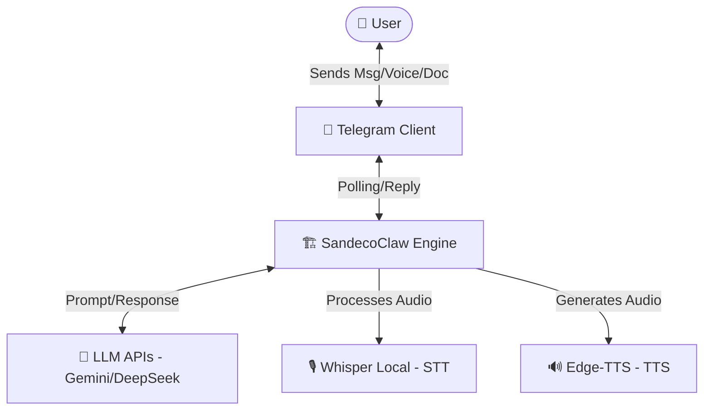
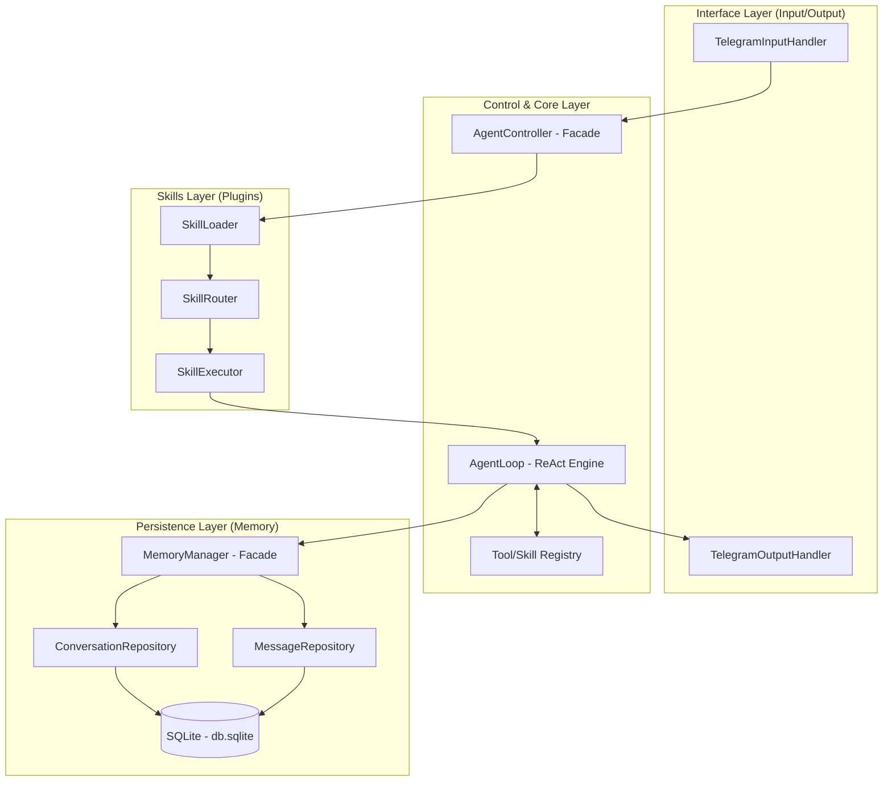
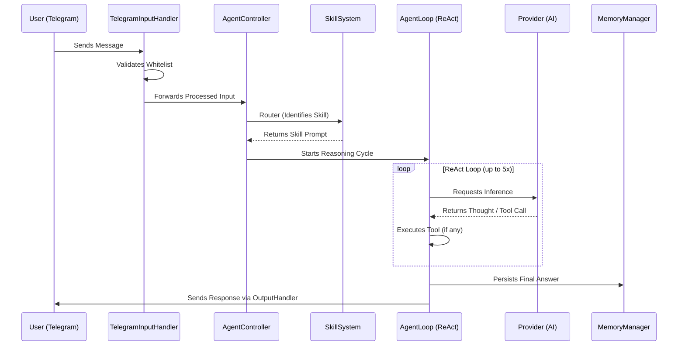

# Architecture: SandecoClaw

**Version:** 1.0  
**Status:** Core Architecture Definition  
**Author:** Antigravity (AI)  
**Date:** 2026-04-24

---

## 1. Overview

**SandecoClaw** is a personal Artificial Intelligence agent designed to operate locally on the user's desktop. Its primary control interface is **Telegram**, allowing fluid interaction via text, documents, and voice. The system is built to be modular, extensible through "skills" (plugins), and fully focused on privacy, maintaining all data persistence locally.

The architecture follows a pipeline flow where Telegram messages are captured, processed by a reasoning engine (Agent Loop) that uses external LLMs (like Gemini or DeepSeek) for inference, and responds back to the user intelligently.

---

## 2. Architectural Requirements

| Requirement | Type | Priority | Notes |
|-----------|------|------------|-------|
| Local Operation | Non-functional | Critical | Core runs on the local host (Windows). |
| Telegram Interface | Functional | High | Uses `grammy` library for polling. |
| Local Persistence | Functional | High | Conversation storage in SQLite. |
| LLM Standardization | Non-functional | High | Dynamic provider switching (Gemini, DeepSeek, Groq). |
| Multimodality (Input) | Functional | Medium | PDF and Voice (Local Whisper) support. |
| Multimodality (Output)| Functional | Medium | Markdown files and Voice (TTS) support. |
| Access Security | Functional | Critical | Strict whitelist based on Telegram User ID. |

---

## 3. Architectural Style

The system adopts a **Modular Monolith with a Plugin System**.
- **Modular Monolith:** Simplifies local development and deployment without microservices complexity.
- **Plugin-based (Skills):** Allows new features to be added or updated via "Hot-Reload" by simply adding directories to the `.agents/skills` folder.

---

## 4. Context Diagram

---

## 5. Components and Layers

The project follows Object-Oriented Programming (OOP) principles with clear separation of responsibilities.

---

## 6. Technology Stack (Source of Truth)

| Component | Technology | Details / Justification |
|------------|------------|-------------------------|
| **Language** | **Node.js (TypeScript)** | Fast IO, rich ecosystem. |
| **Paradigm** | **Object-Oriented** | Classes, Interfaces, and Design Patterns. |
| **Database**| **SQLite** | Local, serverless, fast (`better-sqlite3`). |
| **Bot Interface** | **grammy** | Modern and performant Telegram Bot framework. |
| **AI Reasoning** | **ReAct Pattern** | "Thought -> Action -> Observation -> Answer" loop. |
| **STT (Voice)** | **Whisper (Local)** | Private transcription without API costs. |
| **TTS (Speech)** | **Edge-TTS** | High-quality voice generation (`pt-BR-Thalita`). |
| **Document Parser**| **pdf-parse** | PDF text extraction. |

---

## 7. Design Patterns

1.  **Facade:** Used in `AgentController` and `MemoryManager`.
2.  **Factory:** `ProviderFactory` for LLMs and `ToolFactory` for tools.
3.  **Repository:** For SQLite abstraction (`ConversationRepository`, `MessageRepository`).
4.  **Singleton:** Single instance for database connection.
5.  **Strategy:** In `TelegramOutputHandler` for choosing output formats.
6.  **Registry:** For dynamic Skills and Tools registration.

---

## 8. Critical Flows

### Message Processing Flow

---

## 9. Infrastructure

- **Environment:** Local execution via Terminal.
- **Process Management:** `npm run dev` (nodemon for hot-reload).
- **Data Directories:**
    - `./data/`: SQLite database.
    - `./tmp/`: Temporary files (deleted after use).
    - `.agents/skills/`: Skill plugins in Markdown.
